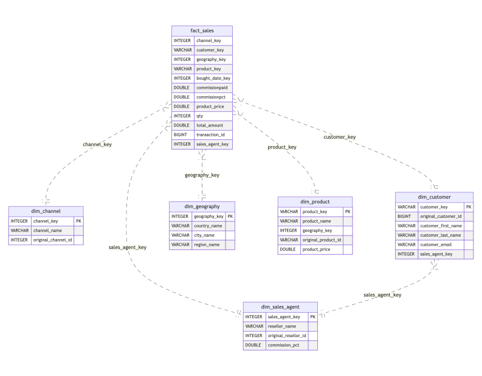

# Postcard Company — Dataform

A **Dataform v3** example project for an imaginary postcard company that sells directly and through resellers across Europe. It demonstrates real-world patterns for building a data warehouse on **BigQuery** using Dataform.

This project is the Dataform equivalent of [postcard-company-datamart](https://github.com/cnstlungu/postcard-company-datamart) (dbt-core + DuckDB).

> **Disclaimer:** This is an example project provided for educational purposes only, made available as-is without any warranties or guarantees. All data is artificially generated using the [Faker](https://faker.readthedocs.io/) library — any resemblance to real persons, companies, or transactions is purely coincidental. The project is not intended for production use.

---

## What it demonstrates

- **Clear separation of concerns** across four layers: source ingestion (`raw_input`) is kept strictly separate from normalization (`raw`), business logic (`staging`), and consumption (`core`)
- **GCS external tables defined in SQL** — source ingestion is part of the Dataform DAG, not a separate pipeline step. Includes both explicit schema and auto-detect patterns, with an explanation of when each applies
- **Multi-source customer unification** — direct customers and two reseller types with different column schemas are merged and deduplicated into a single `dim_customer`, with surrogate keys derived from the appropriate source identifiers
- **Incremental models done right** — `uniqueKey`, watermark-based filtering, `QUALIFY ROW_NUMBER()` deduplication to handle late-arriving duplicates, BigQuery partitioning and clustering
- **No external dependencies for surrogate keys** — `TO_HEX(MD5(...))` implemented once in `includes/helpers.js`, no packages required
- **Unambiguous `ref()` calls** — every reference uses the two-argument `ref("dataset", "table")` form, preventing silent resolution errors when table names collide across layers
- **Unit tests that run locally** — `dataform test` requires no BigQuery connection; all model logic is testable during development
- **Zero hardcoded configuration** — GCP project and GCS path are driven by `workflow_settings.yaml` vars, keeping the repo clean to commit and share

---

## Data model



### Layers

| Layer | Dataset | Description |
|---|---|---|
| `raw_input` | `postcard_company_raw_input` | External tables over GCS Parquet files |
| `raw` | `postcard_company_raw` | Views that normalize column names and add `loaded_timestamp` |
| `staging` | `postcard_company_staging` | Cleaned, typed, deduplicated, surrogate-keyed models |
| `core` | `postcard_company_core` | Dimensions and fact table ready for consumption |

### Dimensions
- `dim_channel`
- `dim_customer`
- `dim_date`
- `dim_geography`
- `dim_product`
- `dim_sales_agent`

### Facts
- `fact_sales` — incremental, partitioned by month, clustered by channel and sales agent

---

## Prerequisites

- [Google Cloud SDK](https://cloud.google.com/sdk/docs/install) (`gcloud` + `gsutil`)
- [Dataform CLI](https://cloud.google.com/dataform/docs/use-dataform-cli) installed (`npm i -g @dataform/cli`)
- A GCP project with BigQuery enabled
- A GCS bucket to store the Parquet source files
- Python 3.10+ (for the data generator)

---

## Getting started

### 1. Authenticate with GCP

```bash
gcloud auth application-default login
```

### 2. Configure the project

Edit `workflow_settings.yaml` with your GCP project ID and GCS bucket path:

```yaml
defaultProject: your-gcp-project-here
vars:
  gcs_parquet_path: gs://your-bucket-here/parquet
```

### 3. Set up Dataform credentials

Create `.df-credentials.json` in the project root:

```json
{
  "projectId": "your-gcp-project-here",
  "location": "EU"
}
```

> Change `location` to match where your BigQuery datasets should be created.

### 4. Generate source data

```bash
cd generator
python3 -m venv .venv
source .venv/bin/activate
pip install -r requirements.txt
python generate.py
cd ..
```

Output lands in `generator/output/`. To control the number of direct transactions (default: 1,000,000):

```bash
N_TRANSACTIONS=100000 python generator/generate.py
```

### 5. Upload Parquet files to GCS

```bash
gsutil -m cp generator/output/*.parquet gs://your-bucket-here/parquet/
```

### 6. Run the pipeline

```bash
# Run everything
dataform run

# Run a single action
dataform run --actions postcard_company_core.fact_sales

# Run all actions with a specific tag
dataform run --tags staging

# Full refresh of an incremental model (rebuilds from scratch instead of merging)
dataform run --full-refresh

# Full refresh of one specific incremental model
dataform run --full-refresh --actions postcard_company_staging.staging_reseller_type1_sales

```

---

## Local development (no BigQuery required)

Compile and run unit tests locally without a BigQuery connection:

```bash
dataform compile   # validates SQL structure and ref() resolution
dataform test      # runs all unit tests
```

Unit tests mock their input tables inline and exercise model logic through the Dataform compiler — no data or credentials needed.

---

## Project structure

```
.
├── workflow_settings.yaml      # Project config: GCP project, location, vars
├── .env.example                # Environment variable reference
├── includes/
│   └── helpers.js              # Surrogate key utility
├── definitions/
│   ├── sources/                # External tables over GCS Parquet (raw_input layer)
│   ├── raw/                    # Normalizing views (raw layer)
│   ├── seeds/                  # Static geography table (100 European cities)
│   ├── staging/                # Cleaned, typed, deduped models (staging layer)
│   ├── core/
│   │   ├── dim/                # Dimension tables (core layer)
│   │   └── fact/               # Fact table (core layer)
│   ├── assertions/             # Data quality assertions
│   └── tests/                  # Unit tests
└── generator/
    ├── generate.py             # Fake data generator (Faker + PyArrow)
    └── requirements.txt
```
