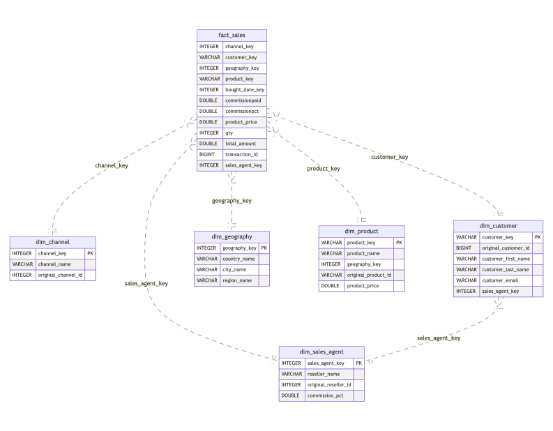

# Postcard Company — Dataform


A **Dataform v3** example project for an imaginary postcard company that sells directly and through resellers across Europe. It demonstrates real-world patterns for building a data warehouse on **BigQuery** using Dataform.

This project is the Dataform equivalent of [postcard-company-datamart](https://github.com/cnstlungu/postcard-company-datamart) (dbt-core + DuckDB).

> **Disclaimer:** This is an example project provided for educational purposes only, made available as-is without any warranties or guarantees. All data is artificially generated using the [Faker](https://faker.readthedocs.io/) library — any resemblance to real persons, companies, or transactions is purely coincidental. The project is not intended for production use.

---

## What it demonstrates

- **Clear separation of concerns** across four layers: source ingestion (`raw_input`) is kept strictly separate from normalization (`raw`), business logic (`staging`), and consumption (`core`)
- **GCS external tables defined in SQL** — source ingestion is part of the Dataform DAG, not a separate pipeline step. Includes both explicit schema and auto-detect patterns, with an explanation of when each applies
- **Multi-source customer unification** — direct customers and two reseller types with different column schemas are merged and deduplicated into a single `dim_customer`, with surrogate keys derived from the appropriate source identifiers
- **Incremental models done right** — `uniqueKey`, watermark-based filtering, `QUALIFY ROW_NUMBER()` deduplication to handle late-arriving duplicates, BigQuery partitioning and clustering
- **No external dependencies for surrogate keys** — `TO_HEX(MD5(...))` implemented once in `includes/helpers.js`, no packages required
- **Unambiguous `ref()` calls** — every reference uses the two-argument `ref("dataset", "table")` form, preventing silent resolution errors when table names collide across layers
- **Unit tests** — `dataform test` executes model logic against mock input tables in BigQuery; a live connection is required but no production data is touched
- **Zero hardcoded configuration** — GCP project and GCS path are driven by `workflow_settings.yaml` vars, keeping the repo clean to commit and share

---

## Data model



### Layers

| Layer | Dataset | Description |
|---|---|---|
| `raw_input` | `postcard_company_raw_input` | External tables over GCS Parquet files |
| `raw` | `postcard_company_raw` | Views that normalize column names and add `loaded_timestamp` |
| `staging` | `postcard_company_staging` | Cleaned, typed, deduplicated, surrogate-keyed models |
| `core` | `postcard_company_core` | Dimensions and fact table ready for consumption |

### Dimensions
- `dim_channel`
- `dim_customer`
- `dim_date`
- `dim_geography`
- `dim_product`
- `dim_sales_agent`

### Facts
- `fact_sales` — incremental, partitioned by month, clustered by channel and sales agent

---

## Prerequisites

- [Google Cloud SDK](https://cloud.google.com/sdk/docs/install) (`gcloud` + `gsutil`)
- [Dataform CLI](https://cloud.google.com/dataform/docs/use-dataform-cli) installed (`npm i -g @dataform/cli`)
- A GCP project with BigQuery enabled
- A GCS bucket to store the Parquet source files
- Python 3.10+ (for the data generator)

---

## Getting started

### 1. Authenticate with GCP

```bash
gcloud auth application-default login
```

### 2. Configure the project

`workflow_settings.yaml` is not tracked, because it ends up holding your real
project and bucket. Copy the template and edit your copy:

```bash
cp workflow_settings.yaml.example workflow_settings.yaml
```

Then set your GCP project ID and GCS bucket path:

```yaml
defaultProject: your-gcp-project-here
vars:
  gcs_parquet_path: gs://your-bucket-here/parquet
```

### 3. Set up Dataform credentials

Create `.df-credentials.json` in the project root:

```json
{
  "projectId": "your-gcp-project-here",
  "location": "EU"
}
```

> Change `location` to match where your BigQuery datasets should be created.

### 4. Generate source data

```bash
cd generator
python3 -m venv .venv
source .venv/bin/activate
pip install -r requirements.txt
python generate.py
cd ..
```

Output lands in `generator/output/`. The generator produces:

| File | Rows | Description |
|---|---|---|
| `main.parquet` | 1,000,000 | Direct sales transactions (see `N_TRANSACTIONS` below) |
| `resellers_type1.parquet` | 100,000 | 2 resellers × 50,000 transactions each |
| `resellers_type2.parquet` | 100,000 | 2 resellers × 50,000 transactions each |
| `customers.parquet` | 100,000 | Direct customer records |
| `products.parquet` | 500 | Product catalogue |
| `channels.parquet` | 3 | Sales channels |
| `resellers.parquet` | 4 | Reseller reference data |

`fact_sales` holds one row per source transaction, so a full pipeline run
produces `N_TRANSACTIONS` + 200,000 rows.

#### Generator settings

All four are environment variables, and all have defaults — the generator runs
with none of them set.

| Variable | Default | Effect |
|---|---|---|
| `SEED` | `42` | Seeds `random` and `Faker`. Change it for a different but equally repeatable dataset. |
| `N_TRANSACTIONS` | `1000000` | Direct sales transactions. The reseller feeds are a fixed 100,000 rows each. |
| `DATA_WINDOW_MONTHS` | `24` | How far back the sales window reaches from `DATA_END_DATE`. |
| `DATA_END_DATE` | today | Last day of the sales window, inclusive. Pin it to an ISO date to reproduce an earlier dataset. |

```bash
# A smaller dataset for a quick run.
N_TRANSACTIONS=50000 python generator/generate.py

# Exactly the dataset that a run on 13 September 2026 produced.
SEED=42 DATA_END_DATE=2026-09-13 python generator/generate.py
```

`SEED` on its own is not enough to reproduce a dataset. The sales window ends on
`DATA_END_DATE`, which defaults to today, so the same seed yields different dates
on different days. Pin `DATA_END_DATE` as well and the parquet files come out
byte for byte identical.

The window also has to stay inside `dim_date`, whose range is declared once in
[`includes/calendar.js`](includes/calendar.js) and mirrored by `CALENDAR_START` /
`CALENDAR_END` in the generator. Sales outside that calendar would produce
`fact_sales` rows whose `bought_date_key` joins to nothing and fail
`assert_fact_sales_date_key_valid`, so the generator refuses to run and names the
setting to change. To model a longer history, widen the calendar in both files —
CI checks that they, and the compiled `dim_date`, agree.

To check the generator after changing it:

```bash
python generator/checks.py
```

### 5. Upload Parquet files to GCS

```bash
gsutil -m cp generator/output/*.parquet gs://your-bucket-here/parquet/
```

### 6. Run the pipeline

```bash
# Run everything
dataform run

# Run a single action
dataform run --actions postcard_company_core.fact_sales

# Run all actions with a specific tag
dataform run --tags staging

# Full refresh of an incremental model (rebuilds from scratch instead of merging)
dataform run --full-refresh

# Full refresh of one specific incremental model
dataform run --full-refresh --actions postcard_company_staging.staging_reseller_type1_sales

```

### 7. Schedule the pipeline

In BigQuery Dataform, create a workflow configuration that runs the daily schedule tag:

```text
Tag: schedule_daily
Include dependencies: true
Include dependents: false
Full refresh: false
```

The `schedule_daily` tag is applied across the build definitions so the daily workflow can be selected directly by tag. Dataform still respects the DAG order, so the scheduled run builds the warehouse layers:

```text
sources -> raw -> staging -> core
```

Assertions keep only the `assertions` tag. If you want a separate validation workflow after the daily build, schedule or trigger:

```text
Tag: assertions
Include dependencies: true
Include dependents: false
Full refresh: false
```

Use a manual full-refresh workflow with the same tag when you need to rebuild incremental tables:

```text
Tag: schedule_daily
Include dependencies: true
Include dependents: false
Full refresh: true
```

Note: `dim_product` is implemented as an operations-based SCD2 table, so a full refresh does not automatically reset its history. Drop and recreate it intentionally if you need a clean product dimension rebuild.

---

## Local development

```bash
dataform compile   # validates SQL structure and ref() resolution — no BigQuery connection needed
dataform test      # runs unit tests against BigQuery using mock input data — requires credentials
```

`dataform compile` is safe to run anywhere with no credentials, which is why CI compiles on every push rather than running the pipeline. Alongside it CI checks that the compiled `dim_date` covers the range the generator enforces, and runs `python generator/checks.py` over freshly generated data. `dataform test` requires a live BigQuery connection but executes against inline mock data, so no production tables are read or written.

---

## Project structure

```
.
├── workflow_settings.yaml      # Project config: GCP project, location, vars
├── .env.example                # Environment variable reference
├── includes/
│   ├── calendar.js             # The calendar range dim_date materialises
│   └── helpers.js              # Surrogate key utility
├── definitions/
│   ├── sources/                # External tables over GCS Parquet (raw_input layer)
│   ├── raw/                    # Normalizing views (raw layer)
│   ├── seeds/                  # Static geography table (100 European cities)
│   ├── staging/                # Cleaned, typed, deduped models (staging layer)
│   ├── core/
│   │   ├── dim/                # Dimension tables (core layer)
│   │   └── fact/               # Fact table (core layer)
│   ├── assertions/             # Data quality assertions
│   └── tests/                  # Unit tests
└── generator/
    ├── generate.py             # Fake data generator (Faker + PyArrow)
    ├── checks.py               # Regression checks for the generated data
    └── requirements.txt
```
